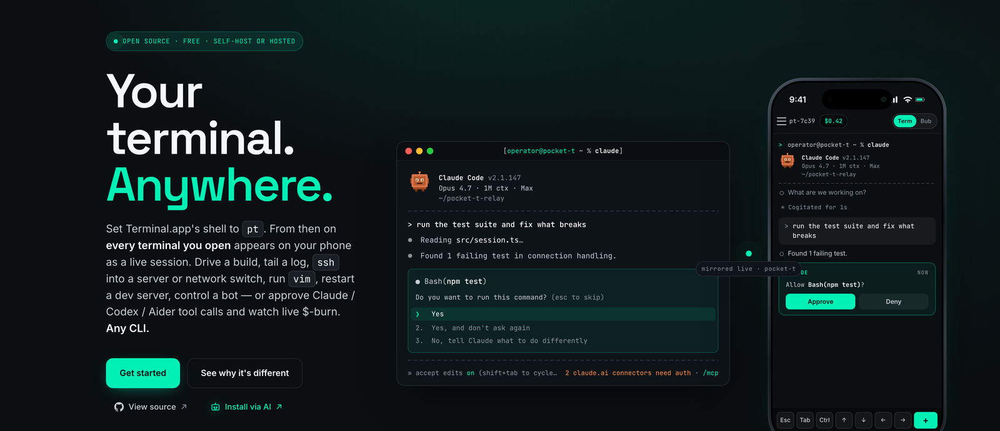

<div align="center">


### Your Mac's terminal — driven from any browser, anywhere.



Pocket-T mirrors every terminal you open on your Mac into a phone, laptop or any browser, live. Tail a production log, `ssh` into a Pi or a router, run a build, edit in `vim`, drive a trading bot, watch `htop` on the office box — or control Claude Code / Codex / OpenClaw / NanoClaw / Hermes / Aider from anywhere. Bidirectional input straight into the real PTY. Live USD cost pill + agent-aware bubble view when a CLI agent is detected. Free Cloudflare tunnel by default — no SSH, no VPN, no Tailscale, no port forwarding.

Sessions are **persistent**: each shell runs inside a private `tmux` server, so the shell — and any agent running in it — survives quitting Terminal.app, logging out, or a daemon restart, and re-attaches with full scrollback. A re-attaching browser is painted the last screen plus recent bubbles and cost, not a blank. When an agent hits an approval and no browser is watching, the daemon can fire a **Web Push** to the installable phone client.

[**Website**](https://pocket-t.ai) • [**Install via AI**](AGENTS.md) • [**Documentation**](docs/) • [**Skins**](docs/skins.md) • [**@Josh_Gier**](https://x.com/Josh_Gier)

[](LICENSE)
[](#quick-start)
[](#quick-start)
[](#architecture)
[](#contributing)
[](https://github.com/Josh-Gi3r/POCKET-T/stargazers)
[](https://x.com/Josh_Gier)

</div>

## Table of Contents

- [Why Pocket-T?](#why-pocket-t)
- [Install via your AI agent](#install-via-your-ai-agent)
- [Quick Start](#quick-start)
- [Features](#features)
- [Architecture](#architecture)
- [Remote Access Options](#remote-access-options)
- [Live Cost Meter](#live-cost-meter)
- [Agent-Aware Bubbles](#agent-aware-bubbles)
- [Persistent Sessions](#persistent-sessions)
- [Push Notifications](#push-notifications)
- [Pocket Skins](#pocket-skins)
- [Session Recording](#session-recording)
- [CLI Reference](#cli-reference)
- [Security](#security)
- [Self-Hosting](#self-hosting)
- [Works With](#works-with)
- [Contributing](#contributing)
- [Credits](#credits)
- [License](#license)

## Why Pocket-T?

Your terminal is where the real work happens — running a build, tailing a production log, SSH'd into a router or a Pi, restarting a dev server, watching `htop` on the box at the office, driving a Telegram or trading bot, debugging in `vim`, **or** running Claude Code / Codex / OpenClaw / NanoClaw / Hermes / Aider / Gemini CLI. The moment you step away from your Mac you lose all of it. Existing options fall short:

- **SSH apps** only show the one shell you connected by hand. New terminals you open on the Mac never appear.
- **Telegram / Discord bots** relay single commands. No live screen, no scrollback, no TUI, no resize.
- **Tailscale / WireGuard + a viewer** works but needs a VPN client installed on every device you might pick up.
- **VS Code Tunnels** is great for editing, not for driving long-running shells, network gear, or agents.
- **screen / tmux + ssh** assumes you already have inbound access to the Mac — no good from a phone on LTE behind CGNAT.

Pocket-T turns every terminal you open on the Mac into a session controllable from any browser, on any network. Bidirectional input straight into the real PTY. Works for **any** CLI — `htop`, `vim`, `tail -f`, `ssh router-edge`, `npm run dev`, `python bot.py`, a Bash script that's been running for two days. For AI-agent CLIs you also get bubble-rendered conversations, a live USD cost pill and approval cards for destructive tools — but those are a layer on top, not the foundation. The terminal is the foundation.

## Install via your AI agent

If you already have Claude Code, Codex, Cursor, Aider or any other agentic CLI on your Mac, the fastest way to install Pocket-T is to let it do it for you:

> *"Read https://github.com/Josh-Gi3r/POCKET-T/blob/main/AGENTS.md and install Pocket-T."*

[`AGENTS.md`](AGENTS.md) is a deterministic, agent-oriented install script — prerequisites, install commands, the one manual Terminal.app step, verification checklist, and a common-failures table. Your agent will walk through it end-to-end, ask you for the one thing it can't automate (the Terminal shell setting), and report back when Pocket-T is running.

Prefer to install it yourself? Keep reading.

## Quick Start

### Requirements

- macOS 14+ (Apple Silicon or Intel)
- Rust toolchain — `curl --proto '=https' --tlsv1.2 -sSf https://sh.rustup.rs | sh`
- Node.js 22+ and pnpm — `brew install node && npm i -g pnpm`
- `cloudflared` for the default tunnel mode — installed automatically by `install.sh` via Homebrew

### 1. Install

```bash
git clone https://github.com/Josh-Gi3r/POCKET-T
cd POCKET-T && bash install.sh
```

The installer verifies prerequisites, builds the workspace, builds + ad-hoc codesigns the native `pt` shell proxy and copies it to `/usr/local/bin/pt`, best-effort installs `cloudflared` via Homebrew, and installs the `pocket` launcher to `/usr/local/bin/pocket`.

### 2. Point Terminal.app at `pt`

Terminal.app → Settings → Profiles → Shell → **Run command:** `/usr/local/bin/pt`. Tick **Run inside shell**. iTerm2, Ghostty and WezTerm have an equivalent setting.

Every new window on that profile is automatically a Pocket-T session — no wrapper command, no per-window flag.

### 3. Start the daemon

Open any terminal that is **not** going through `pt` (e.g. open a fresh `/bin/zsh`, or any non-`pt` profile) and run:

```bash
pocket
```

A public HTTPS URL + QR code print in the terminal. Scan it on your phone — every Terminal.app window you open from now on appears in the browser, live.

Other commands:

```bash
pocket serve              # LAN-only, no tunnel
pocket list               # list active sessions
pocket kill <session-id>  # kill a session
pocket replay <id>        # replay a recorded session
pocket pending            # list pending tool-call approvals
```

Anything not matching a `pocket` subcommand is passed through to the underlying `pt-registry` CLI.

## Features

- 🌐 **Any browser, any network** — Both ends dial out. No inbound ports on the Mac. No SSH, no VPN, no Tailscale.
- 🤖 **Agent-aware bubbles** — Claude conversations render as separate **chat**, **thinking**, **tool-call** and **result** cards. Toggle to raw terminal anytime.
- 💰 **Live cost meter** — Cumulative USD for a Claude session in a toolbar pill, read from the transcript's real token counts — not estimated. Priced by model family: Sonnet, Opus, Haiku, GPT-5, Grok 4.
- ✋ **Tool-call approval from the phone** — Claude PreToolUse hooks surface as approve / deny cards. When no browser is watching, the daemon can fire a Web Push (below). Approvals fail closed when the daemon is exposed.
- ♻️ **Persistent sessions** — Each shell runs inside a private `tmux` server, so the shell + any running agent survive quitting Terminal.app, logging out, or the shim dying. Re-attach and the same shell comes back with scrollback. Falls back to a direct shell when `tmux` isn't installed.
- 🔔 **Push notifications** — With a VAPID key pair configured, an approval raised while no browser is live sends a Web Push to registered devices; the PWA service worker renders it and deep-links to the session.
- 📱 **Installable PWA client** — The default phone UI (`packages/web-client`) is a bubble-first, installable Svelte PWA that reconnects across backgrounding and network changes. A self-contained single-file client is the fallback.
- 🎬 **Session recording** — Opt in with `POCKET_T_RECORD=1` and every session writes a standard `asciinema v2` cast file. Replay with `pocket replay <id>` or any asciinema player.
- 🎨 **7 built-in skins** — Midnight (default), Halloween, Nokia, Christmas, Cyberpunk, Forest, Paper. New skins are pure CSS-variable blocks — ship one in a PR.
- 🔄 **Detach & resume** — On a daemon restart the catalog rehydrates from `tmux` + a persisted state file; a transient `pt` restart is held through a 60-second grace window. Reconnect with the same session ID and history continues.
- ⚡ **Zero configuration** — `--tunnel` gives a public URL via Cloudflare Quick Tunnel. No signup, no card, no relay to deploy.
- 🍎 **Apple Silicon native** — Pure Rust shim, no Rosetta. Intel Macs supported too.
- 🔒 **Token-gated by default** — Every connection carries a bearer token minted at startup and passes an Origin allowlist. MIT licensed; self-host the relay on your own box if you don't want Cloudflare in the path.

## Architecture

```
   Mac
   ┌──────────────────────────────────────┐
   │ Terminal.app  ─ shell ─►  pt ──────► pt-registry
   │                                          │
   └──────────────────────────────────────────┼─────────────┐
                                              │             │
                                  outbound WSS │   outbound WSS
                                              ▼             ▼
                              ┌────────────────────────────────────┐
                              │ Cloudflare Quick Tunnel            │
                              │   OR  self-hosted ws-v3 hub        │
                              │ (a dumb pipe — no state)           │
                              └────────────────────────────────────┘
                                              ▲             ▲
                                  outbound WSS │   outbound WSS
                                              │             │
                              ┌───────────────┴─────────────┴────┐
                              │ Browser (phone, Mac, any device, │
                              │ any network) — xterm.js + bubbles│
                              └──────────────────────────────────┘
```

| Component | Stack | Lines |
|---|---|---:|
| `pt` shell proxy | Rust, `libc`, `forkpty()`, `tmux -L pocket-t` backing, raw-mode signal handling | ~1,080 |
| `pt-registry` daemon | Node 22, TypeScript, Unix sockets, ws-v3 WebSocket, `@xterm/headless`, adapters + hooks + push | ~4,100 |
| `ws-v3` relay hub | Node 22, TypeScript, one file, stateless | ~745 |
| Web client (PWA) | Svelte 5, Vite, `vite-plugin-pwa`, xterm.js (lazy) | ~1,920 |
| Single-file client | xterm.js, `@xterm/addon-fit`, CSS-variable skins | ~1,090 |

Full design: [`docs/architecture.md`](docs/architecture.md).

## Remote Access Options

### Option 1: Cloudflare Quick Tunnel (default)

Free, no signup, no card. Starts in seconds.

```bash
pocket
```

A `*.trycloudflare.com` URL prints with a QR code. URL changes on each restart.

### Option 2: Cloudflare Named Tunnel (stable URL)

Free Cloudflare account, one-click OAuth, then a permanent URL.

```bash
cloudflared tunnel login
cloudflared tunnel create pocket-t
cloudflared tunnel route dns pocket-t pt.yourdomain.com
cloudflared tunnel run pocket-t
```

### Option 3: Self-hosted ws-v3 hub

Docker on any VPS, or Fly.io free tier. Pin a stable daemon token with
`POCKET_T_TOKEN` and reuse it as the relay token — one value routes the
browser to your daemon *and* authenticates it. Open
`https://your-domain/?token=<token>` on the phone.

```bash
docker compose -f infra/docker-compose.yml up -d
export POCKET_T_TOKEN="$(openssl rand -hex 32)"
pocket serve --relay "wss://your-domain/ws/pt?role=daemon&t=$POCKET_T_TOKEN"
```

Full guide: [`docs/self-hosting.md`](docs/self-hosting.md).

### Option 4: Local only

No public exposure. Same-Mac browser access at `http://127.0.0.1:7700/`.

```bash
pocket serve   # no flags = LAN/local only
```

## Live Cost Meter

For Claude Code and Claude CLI sessions, Pocket-T shows a live USD pill in the browser toolbar:

- Reads exact token counts (input, output, cache read, cache write) from Claude's transcript file — not estimated.
- Updates in real time during a session, and dedupes streamed partial turns so cost never double-counts.
- Cumulative across all turns of the session.
- Priced by model family: Sonnet, Opus, Haiku, GPT-5, GPT-5 Mini, Grok 4, Grok 4 Mini. An unrecognized model falls back to Sonnet pricing so the meter still shows a useful number.
- Single source of truth at [`packages/daemon/src/adapters/pricing.ts`](packages/daemon/src/adapters/pricing.ts) — one file to keep current as model prices change.

## Agent-Aware Bubbles

Claude Code sessions get a second view mode — toggle "Bubbles" in the toolbar — where conversations render as separated cards instead of raw VT bytes:

| Bubble kind | Source in Claude's transcript |
|---|---|
| `chat` | User prompts and assistant `text` blocks |
| `thought` | Assistant interleaved `thinking` blocks |
| `action` | `tool_use` blocks (tool name + parameters) |
| `tool_result` | Tool output (with truncation for long outputs) |
| `approval` | Destructive tools awaiting your decision |
| `cost` | Per-turn USD (feeds the cost pill) |

The terminal view stays available — same bytes, two renders. The bubble layer is a non-blocking side-channel that doesn't interfere with the raw PTY stream.

Adding a vendor adapter (Codex, OpenClaw, Hermes…) is one file: mirror [`packages/daemon/src/adapters/ClaudeAdapter.ts`](packages/daemon/src/adapters/ClaudeAdapter.ts) and register it in `KNOWN_VENDORS` at [`adapters/detect.ts`](packages/daemon/src/adapters/detect.ts).

## Persistent Sessions

When `tmux` is on your `PATH`, every Pocket-T session runs its shell inside a **private tmux server** — `tmux -L pocket-t new-session -A -s pocket-t-<id>`. That server owns the PTY and the shell independently of the `pt` shim, so:

- **Quit Terminal.app, log out, or let the shim die** — the shell and anything running in it (an agent, a build, a long `tail -f`) keep running. Open a new terminal (or tap **+** in the browser) and it re-attaches to the same shell with scrollback intact.
- **Restart the daemon** — the session catalog rehydrates from two sources that both survive it: the live tmux server, and a persisted `~/.pocket-t/state.json`. A re-attaching browser is painted the last screen snapshot plus a bounded tail of recent bubbles and the running cost — not a blank terminal.
- **No tmux installed?** Pocket-T transparently falls back to the direct `forkpty` model. Everything still works; the shell just shares the shim's lifetime, exactly like a plain login shell.

**Reboot caveat — read this.** A running shell is a live process, and no userspace layer makes a process survive a literal reboot. Surviving a reboot at the shell level is an **optional setup step**, not automatic: pair a launchd auto-start for the daemon with `tmux-resurrect` + `tmux-continuum` so tmux saves and restores its sessions across boot. The end-to-end runbook is in [`docs/always-on-setup.md`](docs/always-on-setup.md). Without that layer, a reboot ends running shells — the daemon simply comes back to an empty catalog.

## Push Notifications

When an agent raises an approval and **no browser is watching that session**, the daemon can send a [Web Push](https://developer.mozilla.org/en-US/docs/Web/API/Push_API) so the request doesn't sit unseen until the agent times out. The service worker in the PWA renders the notification and, on tap, deep-links straight to the session.

Push is **entirely optional** and off until you configure a VAPID key pair. With no keys set, the daemon logs a one-line hint at startup and every push entry point is a no-op.

### Setup

1. **Generate a VAPID key pair** (once):

   ```bash
   npx web-push generate-vapid-keys
   ```

   It prints a public key and a private key.

2. **Give the daemon the private half.** Set these before `pocket`:

   ```bash
   export POCKET_T_VAPID_PUBLIC_KEY="<public key>"
   export POCKET_T_VAPID_PRIVATE_KEY="<private key>"
   export POCKET_T_VAPID_SUBJECT="mailto:you@example.com"   # optional contact URI
   ```

   On start the daemon logs `web push enabled (<n> subscription(s) restored)`. Subscriptions persist to an owner-only `~/.pocket-t/push-subscriptions.json`, so registered devices keep getting notified across restarts.

3. **Give the client the public half** at build time. The PWA reads it from `VITE_VAPID_PUBLIC_KEY` (it must match the public key above):

   ```bash
   VITE_VAPID_PUBLIC_KEY="<public key>" \
     pnpm --filter @pocket-t/web-client build
   ```

A device registers by POSTing its `PushSubscription` to the token-gated `POST /push/subscribe` endpoint; the daemon then pushes to every registered device when an unattended approval fires. Delivery is best-effort — subscriptions the push service reports as gone (404/410) are pruned automatically.

## Pocket Skins

The single-file client re-themes from a CSS-variable block. Seven skins ship by default:

<div align="center">

| | | | |
|---|---|---|---|
| **Midnight** (default) | **Halloween** | **Nokia** | **Christmas** |
| indigo + violet | brown + pumpkin | pixel-green nostalgia | pine + cranberry + gold |
| **Cyberpunk** | **Forest** | **Paper** | **Yours?** |
| magenta + cyan | moss + sage | daylight + ink (light) | [Ship a skin →](docs/skins.md) |

</div>

Try one immediately by appending `?theme=halloween` (or `nokia`, `cyberpunk`, etc.) to your daemon URL. Contribution guide at [`docs/skins.md`](docs/skins.md).

## Session Recording

Recording is **opt-in**. Start the daemon with `POCKET_T_RECORD=1` and every session writes a standard [asciinema v2](https://github.com/asciinema/asciinema/blob/master/doc/asciicast-v2.md) cast file to `~/.pocket-t/recordings/<sessionId>.cast`:

```bash
POCKET_T_RECORD=1 pocket     # record this run
pocket recordings            # list all recordings
pocket replay <sessionId>    # play at native speed
```

Cast files are written to an owner-only (`0700`) directory because they capture every byte typed, including anything entered at a password prompt — which is exactly why recording is off unless you ask for it. Files are compatible with any asciinema player (terminal `asciinema play`, asciinema.org, the `asciinema-player` npm package), so you can drop a cast into a PR description, an issue, or embed it in docs. Recording is best-effort: a failed write disables itself for that session and logs once, and never interrupts the PTY.

## CLI Reference

`pocket` is a thin wrapper around the underlying `pt-registry` CLI — anything you pass through is forwarded verbatim:

```bash
pocket                           Run the daemon with a Cloudflare Quick
                                 Tunnel (shorthand for `serve --tunnel`).

pocket serve [--tunnel] [--relay <wss-url>]
                                 Run the daemon. --tunnel = Cloudflare
                                 Quick Tunnel. --relay = self-hosted hub.

pocket list                      List active sessions (JSON).
pocket status [--json]           Uptime, counts, I/O totals, pending approvals.
pocket pending [--json]          Outstanding tool approvals.
pocket approve <id> [approve|deny]
                                 Resolve a pending approval from CLI.
pocket recordings [--json]       List asciinema cast files.
pocket replay  <sessionId>       Replay a session at native speed.
pocket input   <id> <text>       Inject bytes into a session's PTY.
pocket kill    <id> [signal]     Signal a session's process group.
                                 Default: SIGHUP (1).
```

## Security

Pocket-T exposes a terminal-control surface, so access to it is gated on every connection.

- **Bearer token on every connection.** The daemon mints a random token at startup. The page load, the browser WebSocket, and any relay peer must all present it — via the `?t=<token>` the daemon prints, an `Authorization: Bearer` header, or the same-origin `HttpOnly` cookie the page sets. An unminted token rejects everything, so nothing is ever served without it. The token is delivered inside the URL the daemon prints, so **keep that URL private** — treat it like a password.
- **Origin allowlist on the WebSocket upgrade.** A `/ws` upgrade only proceeds if its `Origin` is same-origin with the request or a known loopback / tunnel / relay host. A drive-by website's Origin never matches, so it can't open a socket to your daemon even before the token check runs.
- **Loopback by default.** The daemon binds `127.0.0.1:7700`. Cross-network access is opt-in and always outbound — a Cloudflare tunnel or a self-hosted relay, never an inbound port. Set `POCKET_T_BROWSER_HOST=0.0.0.0` to reach it over the LAN (do that only on a trusted network).
- **Relay peers authenticate at the ws-v3 layer.** A relay hub is a dumb pipe with no HTTP handshake to gate, so a relay-attached browser must present the token in its `HELLO` frame before any privileged frame (subscribe, input, resize, kill, spawn) is honored. Until it does, it sees no session list and no PTY bytes.
- **Approvals fail closed when exposed.** When the daemon is reachable beyond the local machine (tunnel, relay, or non-loopback bind) and no browser is connected to answer, PreToolUse tool calls are **denied**, not silently allowed. A loopback-only daemon falls through to Claude's own permission gate instead. Override with `POCKET_T_HOOK_FAILSAFE`:
  - `deny` — fail closed; reject anything that can't get a human approval. Default when exposed.
  - `approve` — auto-approve when no listener is present. Default on loopback-only.
  - `passthrough` — disable the local hook server entirely (Claude's own permissions still apply).
- **Recording is opt-in and local.** Nothing is uploaded by the daemon. Cast files only exist when `POCKET_T_RECORD=1` is set, and they live in an owner-only `~/.pocket-t/recordings/`.

**On the trust boundary:** TLS protects traffic in transit, but there is no end-to-end encryption between the daemon and the browser — a tunnel or relay operator sits in the path and can read terminal bytes. If that trust model isn't acceptable, self-host the relay on infrastructure you control, or put a named tunnel behind [Cloudflare Access](docs/always-on-setup.md).

To report a security issue, see [`SECURITY.md`](SECURITY.md).

## Self-Hosting

Docker:

```bash
docker compose -f infra/docker-compose.yml up -d
```

Fly.io:

```bash
fly launch --copy-config && fly deploy
```

Then on your Mac (pin the token so it also works as the relay account key):

```bash
export POCKET_T_TOKEN="$(openssl rand -hex 32)"
pocket serve --relay "wss://your-domain/ws/pt?role=daemon&t=$POCKET_T_TOKEN"
```

Open `https://your-domain/?token=$POCKET_T_TOKEN` on the phone.
Full guide: [`docs/self-hosting.md`](docs/self-hosting.md).

## Works With

Pocket-T captures the terminal itself, so anything that runs in a shell runs through it. Claude gets full agent-aware bubbles + cost meter today; other CLIs get a clean terminal view + sidebar vendor badge while their dedicated parsers ship.

| Agent | Status | Repo |
|---|---|---|
| Claude Code | ✅ Full bubbles + cost meter | [anthropics/claude-code](https://github.com/anthropics/claude-code) |
| Claude CLI | ✅ Full bubbles + cost meter | [docs.anthropic.com](https://docs.anthropic.com/en/api) |
| Codex | 🟡 Detected, clean terminal + badge, parser WIP | [openai/codex](https://github.com/openai/codex) |
| Grok CLI | 🟡 Detected, clean terminal + badge | [xai](https://x.ai) |
| OpenClaw | 🟡 Detected, clean terminal + badge | [openclaw/openclaw](https://github.com/openclaw/openclaw) |
| NanoClaw | 🟡 Detected, clean terminal + badge | [nanocoai/nanoclaw](https://github.com/nanocoai/nanoclaw) |
| Hermes Agent | 🟡 Detected, clean terminal + badge | [nousresearch/hermes-agent](https://github.com/nousresearch/hermes-agent) |
| Aider | ⚪ Runs as plain terminal | [Aider-AI/aider](https://github.com/Aider-AI/aider) |
| Gemini CLI | ⚪ Runs as plain terminal | [google-gemini/gemini-cli](https://github.com/google-gemini/gemini-cli) |
| Cursor's terminal, Claude Desktop's, MCP servers, `vim`, `htop`, dev servers, REPLs, any TUI | ⚪ Just works | |

## Contributing

PRs welcome. The codebase is compact (~9,000 LOC) and split into focused modules:

- [`packages/pt-shim/`](packages/pt-shim/) — Rust shell proxy with `tmux -L pocket-t` session backing. Open targets: Linux port, signal-handling edge cases.
- [`packages/daemon/`](packages/daemon/) — TypeScript daemon (registry, rehydrate, adapters, hooks, push). New vendor adapters land in `src/adapters/` — mirror `ClaudeAdapter.ts`.
- [`packages/web-client/`](packages/web-client/) — the bubble-first Svelte PWA phone client, served by the daemon from its `dist/`.
- [`packages/relay/`](packages/relay/) — ws-v3 hub. One file, stable.
- [`packages/shared/`](packages/shared/) — wire-format types only.
- [`branding/`](branding/) — brand assets (the marketing homepage is the repo-root `index.html`).
- [`docs/skins.md`](docs/skins.md) — ship a Pocket Skin in one PR (CSS variables only).

Local development:

```bash
pnpm install
pnpm --filter @pocket-t/shared build   # shared types — build first
pnpm -r typecheck
pnpm test                              # 66 vitest specs across 9 files
pnpm lint
pnpm -r build

# The native shell proxy is a separate Rust crate:
cargo build --manifest-path packages/pt-shim/Cargo.toml
```

See [`CONTRIBUTING.md`](CONTRIBUTING.md) for detailed setup.

## Credits

Built on patterns from:

- **[VibeTunnel](https://github.com/amantus-ai/vibetunnel)** (MIT) — Pocket-T's ws-v3 binary frame protocol shape is borrowed from theirs (~30–50 LOC, attribution inline at [`packages/shared/src/ws-v3.ts`](packages/shared/src/ws-v3.ts)). Architectural inspiration for the reconnect-owns-resubscribe pattern and the native shim forwarder pattern (Pocket-T's implementations are independent — TypeScript and Rust respectively). VibeTunnel ships the polished iOS-app-first browser-controls-Mac-terminal experience.
- **[xterm.js](https://github.com/xtermjs/xterm.js)** — in-browser terminal rendering.
- **[asciinema](https://github.com/asciinema/asciinema)** — session recording format.
- **[Cloudflare Tunnel](https://developers.cloudflare.com/cloudflare-one/connections/connect-networks/)** — free zero-infrastructure public URLs.

## License

[MIT](LICENSE) — free to self-host, fork, embed, sell as a service. Keep the attribution.
