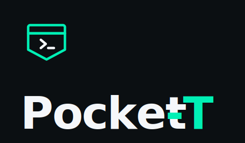

<div align="center">



### Your Mac's terminal — driven from any browser, anywhere.

Pocket-T mirrors every terminal you open on your Mac into a phone, laptop or any browser, live. Tail a production log, `ssh` into a Pi or a router, run a build, edit in `vim`, drive a trading bot, watch `htop` on the office box — or control Claude Code / Codex / OpenClaw / NanoClaw / Hermes / Aider from anywhere. Bidirectional input straight into the real PTY. Live USD cost pill + agent-aware bubble view when a CLI agent is detected. Free Cloudflare tunnel by default — no SSH, no VPN, no Tailscale, no port forwarding.

[**Website**](https://pocket-t.ai) • [**Install via AI**](AGENTS.md) • [**Documentation**](docs/) • [**Skins**](docs/skins.md) • [**Releases**](https://github.com/Josh-Gi3r/POCKET-T/releases) • [**@Josh_Gier**](https://x.com/Josh_Gier)

[](LICENSE)
[](#quick-start)
[](#quick-start)
[](#architecture)
[](#contributing)
[](https://github.com/Josh-Gi3r/POCKET-T/stargazers)
[](https://x.com/Josh_Gier)

</div>

## Table of Contents

- [Why Pocket-T?](#why-pocket-t)
- [Install via your AI agent](#install-via-your-ai-agent)
- [Quick Start](#quick-start)
- [Features](#features)
- [Architecture](#architecture)
- [Remote Access Options](#remote-access-options)
- [Live Cost Meter](#live-cost-meter)
- [Agent-Aware Bubbles](#agent-aware-bubbles)
- [Pocket Skins](#pocket-skins)
- [Session Recording](#session-recording)
- [CLI Reference](#cli-reference)
- [Security](#security)
- [Self-Hosting](#self-hosting)
- [Works With](#works-with)
- [Contributing](#contributing)
- [Credits](#credits)
- [License](#license)

## Why Pocket-T?

Your terminal is where the real work happens — running a build, tailing a production log, SSH'd into a router or a Pi, restarting a dev server, watching `htop` on the box at the office, driving a Telegram or trading bot, debugging in `vim`, **or** running Claude Code / Codex / OpenClaw / NanoClaw / Hermes / Aider / Gemini CLI. The moment you step away from your Mac you lose all of it. Existing options fall short:

- **SSH apps** only show the one shell you connected by hand. New terminals you open on the Mac never appear.
- **Telegram / Discord bots** relay single commands. No live screen, no scrollback, no TUI, no resize.
- **Tailscale / WireGuard + a viewer** works but needs a VPN client installed on every device you might pick up.
- **VS Code Tunnels** is great for editing, not for driving long-running shells, network gear, or agents.
- **screen / tmux + ssh** assumes you already have inbound access to the Mac — no good from a phone on LTE behind CGNAT.

Pocket-T turns every terminal you open on the Mac into a session controllable from any browser, on any network. Bidirectional input straight into the real PTY. Works for **any** CLI — `htop`, `vim`, `tail -f`, `ssh router-edge`, `npm run dev`, `python bot.py`, a Bash script that's been running for two days. For AI-agent CLIs you also get bubble-rendered conversations, a live USD cost pill and approval cards for destructive tools — but those are a layer on top, not the foundation. The terminal is the foundation.

## Install via your AI agent

If you already have Claude Code, Codex, Cursor, Aider or any other agentic CLI on your Mac, the fastest way to install Pocket-T is to let it do it for you:

> *"Read https://github.com/Josh-Gi3r/POCKET-T/blob/main/AGENTS.md and install Pocket-T."*

[`AGENTS.md`](AGENTS.md) is a deterministic, agent-oriented install script — prerequisites, install commands, the one manual Terminal.app step, verification checklist, and a common-failures table. Your agent will walk through it end-to-end, ask you for the one thing it can't automate (the Terminal shell setting), and report back when Pocket-T is running.

Prefer to install it yourself? Keep reading.

## Quick Start

### Requirements

- macOS 14+ (Apple Silicon or Intel)
- Rust toolchain — `curl --proto '=https' --tlsv1.2 -sSf https://sh.rustup.rs | sh`
- Node.js 22+ and pnpm — `brew install node && npm i -g pnpm`
- `cloudflared` for the default tunnel mode — installed automatically by `install.sh` via Homebrew

### 1. Install

```bash
git clone https://github.com/Josh-Gi3r/POCKET-T
cd POCKET-T && bash install.sh
```

The installer verifies prerequisites, builds the workspace, builds + ad-hoc codesigns the native `pt` shell proxy, copies it to `/usr/local/bin/pt`, and installs `cloudflared`.

### 2. Point Terminal.app at `pt`

Terminal.app → Settings → Profiles → Shell → **Run command:** `/usr/local/bin/pt`. Tick **Run inside shell**. iTerm2, Ghostty and WezTerm have an equivalent setting.

Every new window on that profile is automatically a Pocket-T session — no wrapper command, no per-window flag.

### 3. Start the daemon

Open any terminal that is **not** going through `pt` (e.g. open a fresh `/bin/zsh`, or any non-`pt` profile) and run:

```bash
pocket
```

A public HTTPS URL + QR code print in the terminal. Scan it on your phone — every Terminal.app window you open from now on appears in the browser, live.

Other commands:

```bash
pocket serve              # LAN-only, no tunnel
pocket list               # list active sessions
pocket kill <session-id>  # kill a session
pocket replay <id>        # replay a recorded session
pocket pending            # list pending tool-call approvals
```

Anything not matching a `pocket` subcommand is passed through to the underlying `pt-registry` CLI.

## Features

- 🌐 **Any browser, any network** — Both ends dial out. No inbound ports on the Mac. No SSH, no VPN, no Tailscale.
- 🤖 **Agent-aware bubbles** — Claude conversations render as separate **chat**, **thinking**, **tool-call** and **result** cards. Toggle to raw terminal anytime.
- 💰 **Live cost meter** — Cumulative USD per session in a toolbar pill. Sonnet, Opus, Haiku, GPT-5, Grok 4. Exact, from token counts, not estimated.
- ✋ **Tool-call approval from the phone** — Claude PreToolUse hooks surface as approve / deny cards with Web Notification push.
- 📱 **Native phone UX** — Slide-out sidebar drawer, touch keyboard row (Esc, Ctrl, Tab, arrows, brackets), spawn-from-phone, FAB shortcut, safe-area-inset support for notched iPhones.
- 🎬 **Session recording** — Every session writes a standard `asciinema v2` cast file. Replay with `pocket replay <id>` or any asciinema player.
- 🎨 **7 built-in skins** — Operator (default), Halloween, Nokia, Christmas, Cyberpunk, Forest, Paper. New skins are pure CSS-variable blocks — ship one in a PR.
- 🔄 **Detach & resume** — A 60-second grace window means a transient `pt` restart doesn't drop the session. Reconnect with the same session ID and history continues.
- ⚡ **Zero configuration** — `--tunnel` gives a public URL via Cloudflare Quick Tunnel. No signup, no card, no relay to deploy.
- 🍎 **Apple Silicon native** — Pure Rust shim, no Rosetta. Intel Macs supported too.
- 🔒 **Open source, end to end** — MIT licensed. Self-host the relay on your own box if you don't want Cloudflare in the path.

## Architecture

```
   Mac
   ┌──────────────────────────────────────┐
   │ Terminal.app  ─ shell ─►  pt ──────► pt-registry
   │                                          │
   └──────────────────────────────────────────┼─────────────┐
                                              │             │
                                  outbound WSS │   outbound WSS
                                              ▼             ▼
                              ┌────────────────────────────────────┐
                              │ Cloudflare Quick Tunnel            │
                              │   OR  self-hosted ws-v3 hub        │
                              │ (a dumb pipe — no state)           │
                              └────────────────────────────────────┘
                                              ▲             ▲
                                  outbound WSS │   outbound WSS
                                              │             │
                              ┌───────────────┴─────────────┴────┐
                              │ Browser (phone, Mac, any device, │
                              │ any network) — xterm.js + bubbles│
                              └──────────────────────────────────┘
```

| Component | Stack | Lines |
|---|---|---:|
| `pt` shell proxy | Rust, `libc`, `forkpty()`, raw-mode signal handling | ~700 |
| `pt-registry` daemon | Node 22, TypeScript, Unix sockets, ws-v3 WebSocket, `@xterm/headless` | ~2,800 |
| `ws-v3` relay hub | Node 22, TypeScript, one file, stateless | ~580 |
| Browser UI | xterm.js, `@xterm/addon-fit`, CSS-variable skins | ~975 |

Full design: [`docs/architecture.md`](docs/architecture.md).

## Remote Access Options

### Option 1: Cloudflare Quick Tunnel (default)

Free, no signup, no card. Starts in seconds.

```bash
pocket
```

A `*.trycloudflare.com` URL prints with a QR code. URL changes on each restart.

### Option 2: Cloudflare Named Tunnel (stable URL)

Free Cloudflare account, one-click OAuth, then a permanent URL.

```bash
cloudflared tunnel login
cloudflared tunnel create pocket-t
cloudflared tunnel route dns pocket-t pt.yourdomain.com
cloudflared tunnel run pocket-t
```

### Option 3: Self-hosted ws-v3 hub

Docker on any VPS, or Fly.io free tier.

```bash
docker compose -f infra/docker-compose.yml up -d
pocket serve --relay wss://your-domain/ws/pt?role=daemon&t=<token>
```

Full guide: [`docs/self-hosting.md`](docs/self-hosting.md).

### Option 4: Local only

No public exposure. Same-Mac browser access at `http://127.0.0.1:7700/`.

```bash
pocket serve   # no flags = LAN/local only
```

## Live Cost Meter

For Claude Code and Claude CLI sessions, Pocket-T shows a live USD pill in the browser toolbar:

- Reads exact token counts from Claude's transcript file — not estimated.
- Updates in real time during a session.
- Cumulative across all turns of the session.
- Pricing tables for Sonnet (3.5 / 4 / 4.5 / 4.7), Opus, Haiku, GPT-5, GPT-5 Mini, Grok 4, Grok 4 Mini.
- Single source of truth at [`packages/daemon/src/adapters/pricing.ts`](packages/daemon/src/adapters/pricing.ts) — one file to keep current as model prices change.

## Agent-Aware Bubbles

Claude Code sessions get a second view mode — toggle "Bubbles" in the toolbar — where conversations render as separated cards instead of raw VT bytes:

| Bubble kind | Source in Claude's transcript |
|---|---|
| `chat` | User prompts and assistant `text` blocks |
| `thought` | Assistant interleaved `thinking` blocks |
| `action` | `tool_use` blocks (tool name + parameters) |
| `tool_result` | Tool output (with truncation for long outputs) |
| `approval` | Destructive tools awaiting your decision |
| `cost` | Per-turn USD (feeds the cost pill) |

The terminal view stays available — same bytes, two renders. The bubble layer is a non-blocking side-channel that doesn't interfere with the raw PTY stream.

Adding a vendor adapter (Codex, OpenClaw, Hermes…) is one file: mirror [`packages/daemon/src/adapters/ClaudeAdapter.ts`](packages/daemon/src/adapters/ClaudeAdapter.ts) and register it in `KNOWN_VENDORS` at [`adapters/detect.ts`](packages/daemon/src/adapters/detect.ts).

## Pocket Skins

The entire UI re-themes from a CSS-variable block. Seven skins ship by default:

<div align="center">

| | | | |
|---|---|---|---|
| **Operator** (default) | **Halloween** | **Nokia** | **Christmas** |
| graphite + mint | brown + pumpkin | pixel-green nostalgia | pine + cranberry + gold |
| **Cyberpunk** | **Forest** | **Paper** | **Yours?** |
| magenta + cyan | moss + sage | daylight + ink + mint | [Ship a skin →](docs/skins.md) |

</div>

Try one immediately by appending `?theme=halloween` (or `nokia`, `cyberpunk`, etc.) to your daemon URL. Contribution guide at [`docs/skins.md`](docs/skins.md).

## Session Recording

Every session writes a standard [asciinema v2](https://github.com/asciinema/asciinema/blob/master/doc/asciicast-v2.md) cast file to `~/.pocket-t/recordings/<sessionId>.cast`:

```bash
pocket recordings           # list all recordings
pocket replay <sessionId>   # play at native speed
```

Compatible with any asciinema player (terminal `asciinema play`, asciinema.org, the `asciinema-player` npm package). Drop a cast file in a PR description, an issue, or embed in docs. Recording is **on by default** and best-effort — a failed write disables itself for that session and logs once, never interrupts the PTY.

## CLI Reference

`pocket` is a thin wrapper around the underlying `pt-registry` CLI — anything you pass through is forwarded verbatim:

```bash
pocket                           Run the daemon with a Cloudflare Quick
                                 Tunnel (shorthand for `serve --tunnel`).

pocket serve [--tunnel] [--relay <wss-url>]
                                 Run the daemon. --tunnel = Cloudflare
                                 Quick Tunnel. --relay = self-hosted hub.

pocket list                      List active sessions (JSON).
pocket status [--json]           Uptime, counts, I/O totals, pending approvals.
pocket pending [--json]          Outstanding tool approvals.
pocket approve <id> [approve|deny]
                                 Resolve a pending approval from CLI.
pocket recordings [--json]       List asciinema cast files.
pocket replay  <sessionId>       Replay a session at native speed.
pocket input   <id> <text>       Inject bytes into a session's PTY.
pocket kill    <id> [signal]     Signal a session's process group.
                                 Default: SIGHUP (1).
```

xbar / SwiftBar widget at [`packages/daemon/scripts/pt.10s.sh`](packages/daemon/scripts/pt.10s.sh) — traffic-light status icon, session count, pending-approval submenu with one-click approve / deny.

## Security

- The daemon binds `127.0.0.1` only by default. Cross-network access requires either a tunnel or a self-hosted relay, both over outbound connections.
- **Treat the tunnel URL as a password.** Anyone with a live `https://<sub>.trycloudflare.com` URL can view and control your terminal session. Do not paste it in screenshots, streams, chat threads, bug reports, or public logs.
- Cloudflare Quick Tunnel URLs are unauthenticated by default in v0.1. For stronger controls, use a named tunnel with Cloudflare Access (free for personal use) or self-host the ws-v3 hub with your own auth boundary.
- The self-hosted relay matches a shared token string between daemon and browser. Tokens are pass-through — Pocket-T does not run an identity service.
- TLS protects transport, but there is **no end-to-end encryption** between daemon and browser in v0.1. Tunnel/relay operators can technically read terminal bytes. If that trust model is not acceptable, self-host the relay on infrastructure you control.
- All session traffic logs are local (`~/.pocket-t/recordings/`) — nothing is uploaded by the daemon.

- Hook approval fallback is configurable with `POCKET_T_HOOK_FAILSAFE`:
  - `approve` (default): avoid hanging unattended sessions when no browser listener is available.
  - `deny`: fail closed when no listener is available (recommended for unattended Macs).
  - `passthrough`: disable the local hook server entirely.

Report security issues privately rather than opening a public issue.

## Self-Hosting

Docker:

```bash
docker compose -f infra/docker-compose.yml up -d
```

Fly.io:

```bash
fly launch --copy-config && fly deploy
```

Then on your Mac:

```bash
pocket serve --relay wss://your-domain/ws/pt?role=daemon&t=<token>
```

Full guide: [`docs/self-hosting.md`](docs/self-hosting.md).

## Works With

Pocket-T captures the terminal itself, so anything that runs in a shell runs through it. Claude gets full agent-aware bubbles + cost meter today; other CLIs get a clean terminal view + sidebar vendor badge while their dedicated parsers ship.

| Agent | Status | Repo |
|---|---|---|
| Claude Code | ✅ Full bubbles + cost meter | [anthropics/claude-code](https://github.com/anthropics/claude-code) |
| Claude CLI | ✅ Full bubbles + cost meter | [docs.anthropic.com](https://docs.anthropic.com/en/api) |
| Codex | 🟡 Detected, clean terminal + badge, parser WIP | [openai/codex](https://github.com/openai/codex) |
| OpenClaw | 🟡 Detected, clean terminal + badge | [openclaw/openclaw](https://github.com/openclaw/openclaw) |
| NanoClaw | 🟡 Detected, clean terminal + badge | [nanocoai/nanoclaw](https://github.com/nanocoai/nanoclaw) |
| Hermes Agent | 🟡 Detected, clean terminal + badge | [nousresearch/hermes-agent](https://github.com/nousresearch/hermes-agent) |
| Aider | ⚪ Runs as plain terminal | [Aider-AI/aider](https://github.com/Aider-AI/aider) |
| Gemini CLI | ⚪ Runs as plain terminal | [google-gemini/gemini-cli](https://github.com/google-gemini/gemini-cli) |
| Cursor's terminal, Claude Desktop's, MCP servers, `vim`, `htop`, dev servers, REPLs, any TUI | ⚪ Just works | |

## Contributing

PRs welcome. The codebase is small (~7,100 LOC) and split into focused modules:

- [`packages/pt-shim/`](packages/pt-shim/) — Rust shell proxy. Open targets: Linux port, signal-handling edge cases.
- [`packages/daemon/`](packages/daemon/) — TypeScript daemon. New vendor adapters land in `src/adapters/` — mirror `ClaudeAdapter.ts`.
- [`packages/relay/`](packages/relay/) — ws-v3 hub. One file, stable.
- [`packages/shared/`](packages/shared/) — wire-format types only.
- [`site/`](site/) — marketing homepage. Brand assets in [`branding/`](branding/).
- [`docs/skins.md`](docs/skins.md) — ship a Pocket Skin in one PR (CSS variables only).

Local development:

```bash
pnpm install
pnpm --filter @pocket-t/shared build
pnpm -r typecheck
pnpm test         # 21 vitest specs
pnpm lint
pnpm -r build
```

See [`CONTRIBUTING.md`](CONTRIBUTING.md) for detailed setup.

## Credits

Built on patterns from:

- **[VibeTunnel](https://github.com/amantus-ai/vibetunnel)** (MIT) — Pocket-T's ws-v3 binary frame protocol shape is borrowed from theirs (~30–50 LOC, attribution inline at [`packages/shared/src/ws-v3.ts`](packages/shared/src/ws-v3.ts)). Architectural inspiration for the reconnect-owns-resubscribe pattern and the native shim forwarder pattern (Pocket-T's implementations are independent — TypeScript and Rust respectively). VibeTunnel ships the polished iOS-app-first browser-controls-Mac-terminal experience.
- **[xterm.js](https://github.com/xtermjs/xterm.js)** — in-browser terminal rendering.
- **[asciinema](https://github.com/asciinema/asciinema)** — session recording format.
- **[Cloudflare Tunnel](https://developers.cloudflare.com/cloudflare-one/connections/connect-networks/)** — free zero-infrastructure public URLs.

## License

[MIT](LICENSE) — free to self-host, fork, embed, sell as a service. Keep the attribution.
